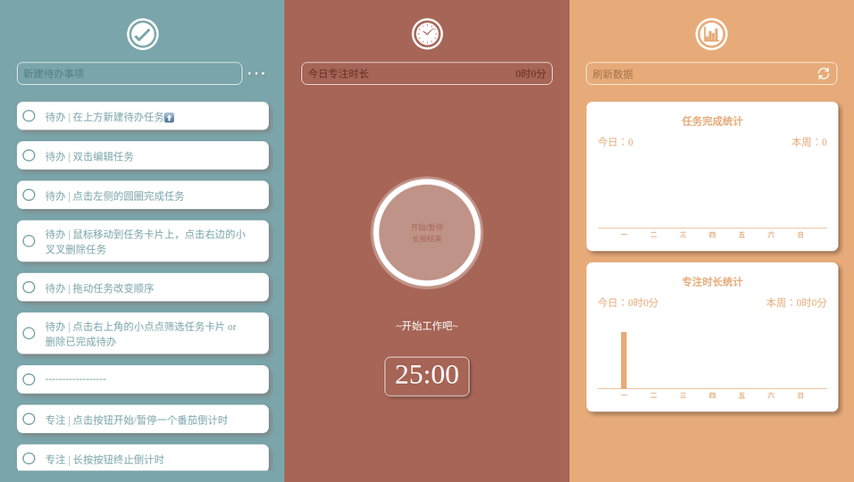

# A Simplified Pomodoro Work Website
## Introduciton:
The repository holds the code of a website introduced as follows. 

[Click here to visit the site](https://just-focus-work.juuggo.com)

I didn't get a satisfied task and pomodoro tool as I mostly work with computer, especially with web browers (Though there're all kinds of mobile time management app). 

Since my requirement is of lite use, I wrote this website which apply to a simplified pomodoro technique. 
It consists of the three parts: 
* To-do list
* Pomodoro Timer
* Weekly tatistics

All data are stored in your own browser and won't be uploaded, so the privacy is fully guaranteed.

## Preview: 

